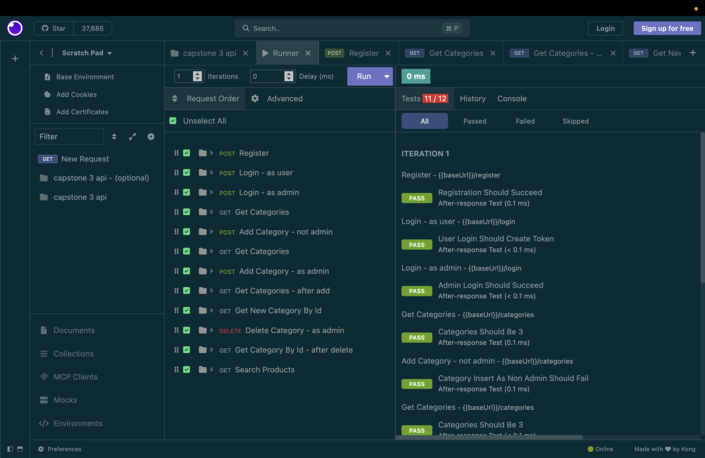
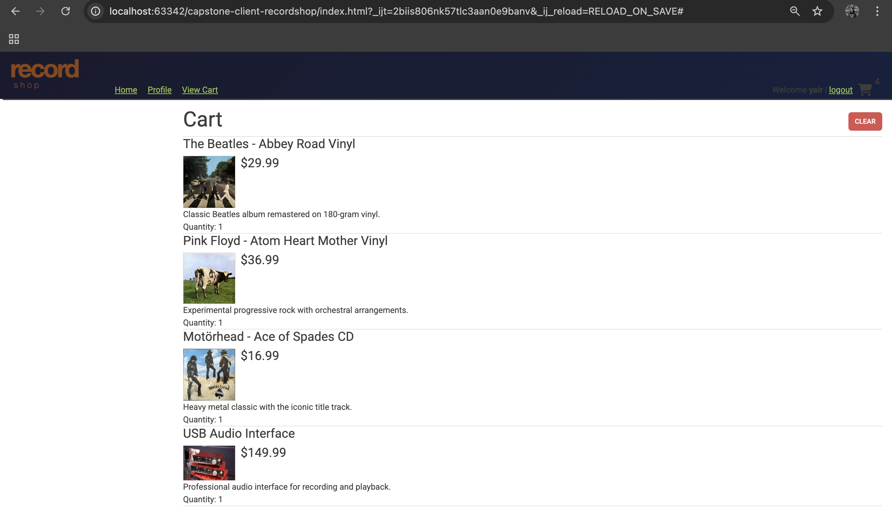
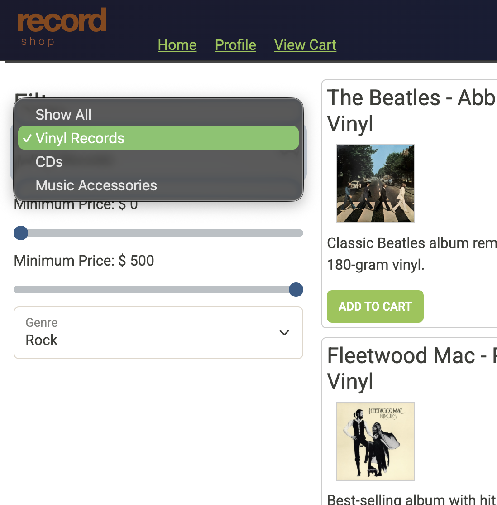

# Record Shop API and Website

## 🚀 About
This Capstone 3 project is a Spring Boot API for a simple online record store application. It provides users 
with the ability to manage products, shopping carts, orders, and accounts.

## 💡 Features
* Ability to browse through the online store
* Sort items by price, category, genre and item type 
* Add items to cart
* View item descriptions

## 💻 Technologies / Built With
- **Language:** Java and SQL
- **Framework:** Spring Boot 
- **Database:** MySQL

## Insomnia Tests

## Shopping Cart 

## Sorting by Categories

